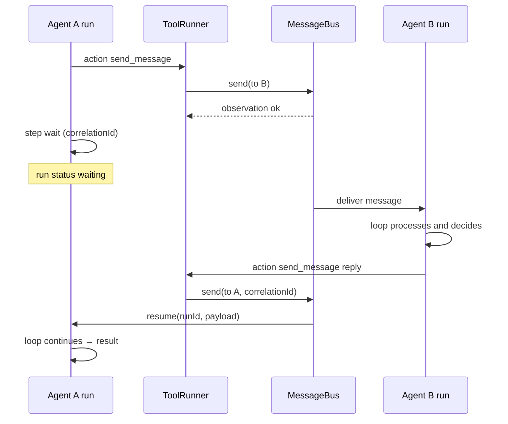

# Multi-agent communication

How multiple agents **send messages** and **coordinate** without leaving the engine model: one loop per agent, **tools** to send, **MessageBus** to deliver, and **`wait` / `resume`** when a reply is needed.

Related product/HTTP doc: [../brainstorm/07-multi-agente-rest-sesiones.md](../brainstorm/07-multi-agente-rest-sesiones.md). Isolation and permissions: [08-scope-and-security.md](./08-scope-and-security.md).

---

## 1. Principle

- Each agent still has its own **AgentExecution** and **run**.
- Collaboration is not “one LLM with many voices”: it is **asynchronous** (or correlated) messages between runs.
- The engine does **not** replace the MessageBus; the bus is **infrastructure** used by tools and the runtime.

---

## 2. MessageBus

Minimal abstraction to deliver messages between agents in the same **project** (same `projectId`).

### Responsibilities

| Function | Expected behavior |
|----------|-------------------|
| **Routing** | Messages addressed by `toAgentId` (and optionally `sessionId`). |
| **Per-agent queue** | Each agent consumes from its queue (FIFO or priority per policy). |
| **Correlation** | Optional `correlationId` to pair question/answer in `wait` / Promise. |
| **Isolation** | No cross-`projectId` leakage; reject cross-tenant sends unless explicitly allowed. |

### Conceptual API

```typescript
interface AgentMessage {
  id: string;
  correlationId?: string;
  fromAgentId: string;
  toAgentId: string;
  projectId: string;
  sessionId?: string;
  type: "request" | "reply" | "event";
  payload: unknown;
  meta?: { ts: string };
}

interface MessageBus {
  send(msg: Omit<AgentMessage, "id">): Promise<void>;
  /** Wait for a message matching filter (e.g. correlationId or fromAgentId) */
  waitFor(
    agentId: string,
    filter: { correlationId?: string; fromAgentId?: string },
    options?: { timeoutMs?: number }
  ): Promise<AgentMessage>;
}
```

Possible implementations: in-process (EventEmitter + Map of queues), **Redis lists/streams** (Upstash) for multiple processes, or a dedicated queue.

---

## 3. `send_message` tool

The LLM does **not** talk to the other agent directly: it emits an `action` that **ToolRunner** maps to this tool.

### Typical input (to the bus)

```json
{
  "to": "agent-b",
  "type": "request",
  "content": { "task": "check policy compliance", "context": "…" },
  "correlationId": "optional-uuid",
  "sessionId": "same-session-if-applicable"
}
```

### Output (observation)

```json
{
  "success": true,
  "enqueued": true,
  "messageId": "…"
}
```

The tool **only enqueues** (or sends); it does not block the sender’s loop unless the design uses internal `await` until bus ACK (not recommended: prefer explicit `wait`).

---

## 4. Coordination patterns

### 4.1 Fire-and-forget

Agent A sends an event to B and continues its run to `result` without waiting. Useful for notifications.

### 4.2 Request–reply (recommended with `wait`)

1. A generates `correlationId`, runs `send_message` to B.
2. A emits `wait` with `reason: external_event` or `agent_reply` convention, storing `correlationId` in `state.pending`.
3. B, in its run, processes the message, runs its LLM, then uses `send_message` **reply** with the same `correlationId`.
4. A’s runtime (or a light **watcher** on the bus) sees the reply and **resume**s A’s run with the payload.

This preserves core semantics: **wait** persists the run; **resume** continues the loop.

### 4.3 SDK: `onWait` + bus

```typescript
await agentA
  .run("Ask B for validation")
  .onWait(async (w) => {
    if (w.details?.kind === "agent_reply") {
      return messageBus.waitFor(agentA.id, {
        correlationId: w.details.correlationId,
        timeoutMs: 30_000,
      });
    }
  })
  .then((r) => …);
```

(Pseudocode assumes the runtime wires the reply to `wait`; exact implementation may use an **orchestrator** that calls `resume` when the message arrives.)

---

## 5. End-to-end flow



---

## 6. Security and scope

- **Same `projectId` only** by default; validate in `send_message` and in the bus ([08-scope-and-security.md](./08-scope-and-security.md)).
- **SecurityLayer** should limit which principals may trigger inter-agent messages (scope like `agents:send`).
- Do not put other tenants’ data in model B’s prompt even if `fromAgentId` is trusted: filter `payload` by policy.

---

## 7. CLI and REST (reference)

```bash
agent-cli send <fromAgentId> <toAgentId> --session <sessionId> --message '{"type":"request",...}'
```

```http
POST /agents/:fromAgentId/send
```

Body aligned with bus payload; server validates project and permissions before `MessageBus.send`.

---

## 8. Risks and mitigation

| Risk | Mitigation |
|------|------------|
| **Deadlock** A waits for B and B waits for A | Timeouts on `waitFor`; chain depth limits; cycle detection in orchestrator. |
| **Orphan messages** | Queue TTL; expiring `correlationId`; run `failed` on timeout. |
| **Two runs of the same agent** | Bind messages to `runId` as well as `agentId` if disambiguation is needed. |
| **Load** | Per-project throttling; queues with backpressure. |

---

## 9. Multi-agent MVP (engine)

- One in-process or Redis **MessageBus**.
- **`send_message`** tool registered and allowed only where the product requires it.
- **One** documented request–reply flow + tests.
- No complex graphical orchestration until the bus and cross-`wait`/`resume` are stable.
